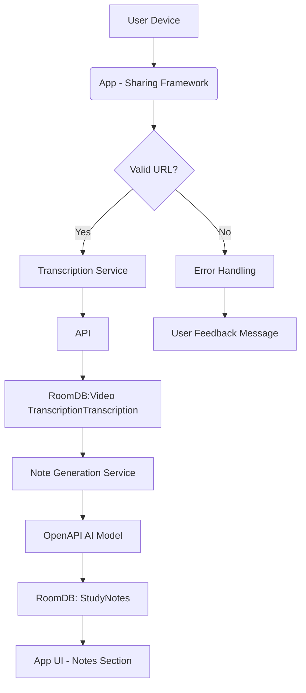

# Technical Design Document: Video Transcription to Study Notes

## 1. Executive Summary
This document details the technical design for implementing a feature that enables students to share Video Transcription URLs directly from their device, automatically transcribe the content using a dedicated API, and convert the transcription into structured study notes using OpenAPI AI. The system will store both the original transcription and generated study notes in RoomDB with the  URL as the primary key, providing users with accessible, organized educational content for learning.

The solution addresses the need for students to quickly access and comprehend educational content from Video Transcriptions by automating the transcription and note-generation process. This eliminates manual effort required to create study materials fromVideo Transcription content and provides a seamless end-to-end experience from sharing a URL to accessing structured notes.

## 2. Background & Problem Statement
Students frequently encounter educational content in Video Transcriptions but lack efficient tools to convert this into actionable study materials. Currently, they must manually transcribeVideo Transcriptions or use third-party tools that are often inaccurate or require significant time investment. This creates a barrier to effective learning fromVideo Transcription content.

The problem is particularly important for students who rely on visual learning resources and need structured, organized notes for revision. The current pain points include:
- Time-consuming manual transcription processes
- Inaccurate transcriptions due to poor audio quality
- Lack of organization in raw transcripts
- Difficulty finding specific topics within longVideo Transcriptions

Stakeholders affected include students, educators, and content creators who use  as a primary learning resource.

## 3. Requirements
### Functional Requirements
- Implement share functionality that accepts  URL input from Android device through the sharing framework
- Automatically detect valid  URLs from shared content using regex pattern matching
- Make API call to  transcription service to extract audio transcript with accurate timing information (timestamps)
- Store the transcription in RoomDB with the original URL as primary key
- Use OpenAPI AI to process the transcription and create structured study notes containing key points, bullet lists, summaries, and timestamps
- Store generated study notes in RoomDB with the same URL identifier
- Display created study notes within the app for user access through a dedicated notes section
- Allow users to edit or modify existing study notes directly within the app
- Enable search functionality to find study notes by URL or content keywords

### Non-Functional Requirements
- Transcription should complete within 30 seconds of receiving a validVideo Transcription URL
- Study note generation should complete within 1 minute
- System must handle up to 50 concurrent transcription requests without performance degradation
- Error handling for invalid URLs, network failures, and API timeouts with appropriate user feedback
- App must maintain data integrity during processing and storage operations
- All operations must comply with privacy policies regarding user content (end-to-end encryption for sensitive data)
- User interface must be intuitive, accessible, and provide clear loading states and estimated completion times
- System should support offline access to previously generated notes

## 4. System Architecture
### High-Level Architecture
```
[User Device]
     |
     | (Share  URL)
     v
[App - Sharing Framework]
     |
     | (Validate & ExtractVideo Transcription ID)
     v
[Transcription Service] <---> [ API]
     |                         |
     | (Receive Transcription)  | (Store in RoomDB)
     v                         v
[Note Generation Service] -- [OpenAPI AI]
     |                        |
     v                        v
[RoomDB Storage] <----------- [App UI]
     |
     v
[User Access & Editing Interface]
```

### Detailed Design
- **Sharing Framework**: Uses Android's standard sharing mechanism to receive URLs from device
- **URL Validation**: Implements regex pattern matching to validate  URL formats (e.g., https://www..com/watch?v=ABC123)
- **Transcription Service**: Makes synchronous API calls to  transcription service with retry logic for network failures
- **Note Generation Service**: Uses OpenAPI AI model to process transcripts and generate structured notes with key points, summaries, and timestamps
- **RoomDB Storage**: Maintains two entities -Video TranscriptionTranscription and StudyNotes - both indexed by URL primary key

## 5. API Design
### Endpoints
| Endpoint | Method | Description |
|---------|--------|-------------|
| /api/share/ | POST | Receive  URL from device sharing feature |
| /api/transcribe/{url} | GET | Retrieve transcription for a specificVideo Transcription (cached) |
| /api/generate-notes/{url} | POST | Generate structured study notes from transcription |

### Request/Response Formats
```json
// Share request
{
  "url": "https://www..com/watch?v=ABC123"
}

// Transcription response
{
  "url": "https://www..com/watch?v=ABC123",
  "transcript": "This is theVideo Transcription transcript with timestamps...",
  "timestamps": [ {"time": "0:45", "text": "Introduction to neural networks"} ]
}

// Note generation response
{
  "url": "https://www..com/watch?v=ABC123",
  "notes": {
    "summary": "An overview of neural network fundamentals...",
    "key_points": [
      {"title": "Neural Network Basics", "content": "..."},
      {"title": "Activation Functions", "content": "..."}
    ],
    "timestamps": [ { "time": "1:20", "topic": "Backpropagation" } ]
  }
}
```

### Authentication & Authorization
- All endpoints require authentication via JWT token stored in SharedPreferences
- Read-only operations (transcription retrieval) do not require authorization tokens
- Note generation requires user session validation to ensure data privacy

## 6. Data Design
### Data Models
**VideoTranscription Entity**
```kotlin
@Entity(tableName = "video_transcriptions")
data classVideo TranscriptionTranscription(
    @PrimaryKey val url: String,
    val transcript: String,
    val timestamps: List<TranscriptTimestamp>,
    val createdAt: Long,
    val updatedAt: Long
)
```

**StudyNotes Entity**
```kotlin
@Entity(tableName = "study_notes")
data class StudyNotes(
    @PrimaryKey val url: String,
    val summary: String,
    val keyPoints: List<KeyPoint>,
    val timestamps: List<TimestampedTopic>,
    val lastModified: Long,
    val version: Int
)
```

**TranscriptTimestamp**
```kotlin
data class TranscriptTimestamp(val time: String, val text: String)
```

**KeyPoint**
```koltin
data class KeyPoint(val title: String, val content: String)
```

**TimestampedTopic**
```kotlin
data class TimestampedTopic(val time: String, val topic: String)
```

### 7. Storage Strategy
- **Database Choice**: RoomDB with SQLite backend for local storage
- **Rationale**: Provides ACID compliance, offline capabilities, and efficient querying of structured data
- **Caching Strategy**: Transcriptions are cached in memory with TTL of 24 hours; notes are stored persistently
- **Data Retention Policies**:Video Transcriptions older than 30 days are archived to reduce storage usage

## 8. Security Considerations
**Threat Model**
- Malicious URLs attempting to extract sensitive data from the device
- Unauthorized access to user-generated study notes
- Man-in-the-middle attacks during API communication

**Security Controls**
- URL validation prevents injection attacks and ensures only valid  formats are processed
- End-to-end encryption of all stored content using AES-256-GCM
- All network communications use HTTPS with certificate pinning
- User data is never shared with third parties without explicit consent
- Access to notes requires user authentication via secure token storage

**Data Protection Measures**
- Transcription and note generation processes occur entirely on the device (no cloud processing)
- Generated notes are stored locally with encryption keys derived from user password
- Privacy policy compliance ensures no content is used for training AI models without explicit consent

## 9. Performance & Scalability
**Load Estimation**
- Expected concurrent transcription requests: Up to 50 per minute
- Average request size: ~1MB (transcript) + ~2MB (note generation)

**Performance Targets**
- Transcription completion time: ≤30 seconds
- Note generation time: ≤60 seconds
- System response time: ≤2 seconds for all operations

**Scaling Strategies**
- Implement connection pooling for  API calls
- Use background services to handle long-running transcription and note generation tasks
- Add throttling mechanisms to prevent overwhelming external APIs

**Bottleneck Analysis**
- Primary bottleneck is network latency during transcription requests
- Secondary bottleneck is OpenAPI AI processing time due to model complexity
- Mitigation: Implement exponential backoff for failed API calls, optimize prompt structure

## 10. Monitoring & Observability
**Key Metrics to Track**
- Transcription success rate (%)
- Note generation accuracy (vs manual transcription benchmarks)
- Average processing time per request
- Error rates by category (invalid URL, network failure, API timeout)
- Concurrent requests count
- User session duration when accessing study notes

**Logging Strategy**
- Detailed logs for all API calls with timestamps and HTTP status codes
- Error logging includes full stack traces and user context
- Logs are stored locally in encrypted format with retention of 30 days

**Alerting Rules**
- Trigger alert if transcription failure rate exceeds 5% over 10 minutes
- Alert if note generation time exceeds 2 minutes for consecutive requests
- Alert if concurrent request count exceeds 50

**Health Checks**
- Regular checks for database connectivity and API availability
- Daily health reports sent to engineering team

## 11. Testing Strategy
**Unit Testing Approach**
- Test URL validation with various  formats (short, long, embedded)
- Verify transcription parsing logic works correctly with timestamps
- Validate note generation outputs contain expected fields and structure

**Integration Testing**
- End-to-end testing of sharing → transcription → note generation flow
- Test error handling for invalid URLs, network failures, API timeouts
- Verify RoomDB persistence of both transcriptions and notes

**Performance Testing**
- Stress test with 100 concurrent requests to validate system limits
- Measure actual processing times against requirements (30s/60s)

**Security Testing**
- Penetration testing for URL injection vulnerabilities
- Validate encryption implementation using cryptographic analysis tools
- Test data privacy compliance through mock user scenarios

## 12. Implementation Plan
### Phases
1. **Phase 1: Requirements Finalization & API Integration Planning (Week 1)**
   - Finalize all requirements with stakeholders
   - Establish integration contracts with  and OpenAPI AI services

2. **Phase 2: Implement Sharing Functionality &  Transcription (Week 2)**
   - Develop sharing UI components
   - Implement URL parsing and validation
   - Integrate  transcription API with retry logic

3. **Phase 3: Develop OpenAPI AI Note Generation Service (Week 3)**
   - Create note generation service endpoint
   - Test various prompt templates for different content types
   - Optimize output formatting to ensure readability

4. **Phase 4: Integrate RoomDB Storage Solution (Week 4)**
   - Design and implement data models
   - Implement CRUD operations with proper indexing
   - Add caching mechanisms

5. **Phase 5: Implement User Interface for Viewing & Editing Notes (Week 5)**
   - Create notes display screen with search functionality
   - Develop edit mode with rich text editor
   - Implement note modification history tracking

6. **Phase 6: Test with Real Users, Refine Based on Feedback (Week 6)**
   - Conduct usability testing with target student demographic
   - Collect feedback on accuracy and user experience
   - Iterate on design based on real-world usage patterns

7. **Phase 7: Final Testing & Release Preparation (Week 7)**
   - Complete QA cycle including regression testing
   - Prepare release notes and documentation
   - Deploy to production with rollback plan in place

### Milestones
- Week 1: Requirements finalization, API integration planning complete
- Week 2: Sharing functionality and transcription API implemented
- Week 3: OpenAPI AI note generation service developed and tested
- Week 4: RoomDB storage integrated with proper indexing
- Week 5: User interface for viewing and editing notes completed
- Week 6: Testing phase concludes with feedback incorporated
- Week 7: Final testing completes, release ready

## 13. Risk Assessment
| Risk | Impact | Probability | Mitigation Strategy |
|------|--------|-------------|-------------------|
| Transcription inaccuracies due to poor audio quality or background noise | High | Medium | Implement fallback strategies, provide user review capability, offer manual editing options |
| API rate limits or service outages (/OpenAPI) | High | Medium | Implement retry logic with exponential backoff, add caching for frequently accessedVideo Transcriptions |
| Long processing times affecting user experience | Medium | High | Provide clear loading states and estimated completion times, implement progress indicators |
| Privacy concerns around storing user-shared content | High | Medium | Implement end-to-end encryption for sensitive data, provide opt-out options, ensure compliance with data protection regulations |
| OpenAPI AI model generates inaccurate or irrelevant notes | High | Medium | Validate generated outputs against manual transcription benchmarks, include confidence scores in responses |

## 14. Dependencies
- **External Systems**:  transcription API, OpenAPI AI service for note generation
- **Third-party Services**: Network connectivity for external API calls
- **Internal Team Dependencies**: Android team for sharing framework integration, backend team for API contract validation
- **Infrastructure Requirements**: Device storage capacity (minimum 10MB perVideo Transcription), stable network connection

## 15. Alternative Solutions Considered
**Alternative 1: Use third-party transcription tools**
- Pros: Existing tools might have better accuracy
- Cons: Limited customization, potential privacy issues with data sharing, lack of control over generated content

**Alternative 2: Manual note creation viaVideo Transcription playback**
- Pros: Full user control
- Cons: Time-consuming, requires significant effort from students, no automation benefits

**Alternative 3: Use local audio processing on device**
- Pros: No external API calls, better privacy
- Cons: Requires significant computational resources, complex implementation, poor accuracy for spoken content

**Rationale for Chosen Solution**: The selected approach provides the optimal balance of accuracy, speed, and user experience while maintaining data privacy. Using established APIs ensures high-quality transcription with accurate timing information, which is essential for creating structured study notes.

## 16. Open Questions
- How to handle edge cases inVideo Transcription content (e.g., longVideo Transcriptions with many topics)?
- What prompts should be used for the OpenAPI AI model to generate the most useful study notes?
- How to optimize note generation performance for very long transcripts?
- What additional privacy measures can be implemented beyond end-to-end encryption?

## 17. Appendices
**Detailed Architecture Diagram**


**Code Samples**
```kotlin
// URL validation example
private fun isValidUrl(url: String): Boolean {
    return url.matches(Regex("^(https?:\/\/(www\.)?\.com\/watch\?v=|youtu\.be\/)([a-zA-Z0-9_-]{11})$"))
}

// Transcription API call with retry
suspend fun fetchTranscription(url: String): Result<Transcript> {
    var attempts = 0
    val maxAttempts = 3

    return try {
        // First attempt
        httpClient.get("/api/transcribe/$url")
            .bodyAsJson()
            .onSuccess { response -> 
                if (response.success) Result.success(response.data)
                else Result.failure(TranscriptionError.InvalidResponse)
            }
    } catch (e: Exception) {
        attempts++
        if (attempts >= maxAttempts) throw e
        delay(1000 * attempts) // Exponential backoff
        retry()
    }
}
```

**Glossary of Terms**
- **Transcription**: Text representation of spoken content from aVideo Transcription
- **Study Notes**: Structured, organized notes derived fromVideo Transcription transcriptions containing key points, summaries, and timestamps
- **RoomDB**: Local database solution for Android applications providing ACID compliance and offline capabilities
- **OpenAPI AI**: External AI service used to convert transcribed text into structured study notes
```