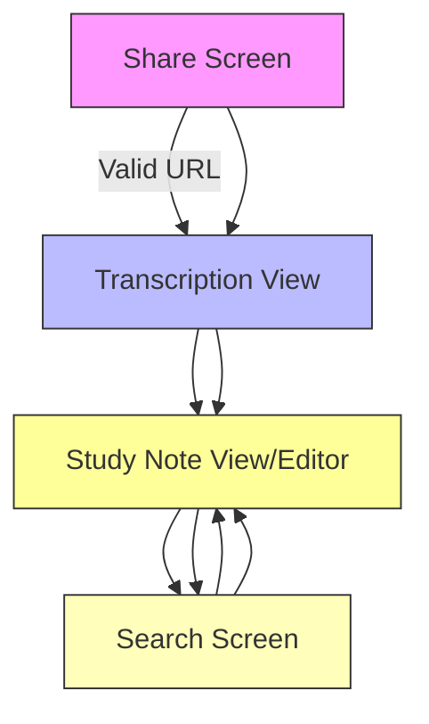

# Application Navigation Design

## Overview
This navigation structure supports the video transcription-to-study-notes feature, enabling students to share video URLs, automatically transcribe them, and convert transcripts into structured study notes. The design prioritizes a seamless flow from URL sharing to note creation and access, with clear accessibility features for all screens.

## Screen Inventory
- **Share Screen**: Primary entry point where users can share Video Transcription URLs from their device.
- **Transcription View**: Displays the extracted audio transcript with accurate timing information.
- **Study Note View/Editor**: Shows structured study notes (key points, summaries) and allows users to view, edit, or modify content.
- **Search Screen**: Enables users to find existing study notes by URL or content.

## Navigation Graph

## Screen Details
### Share Screen
- **Purpose**: Allow users to initiate the video transcription process by sharing a URL from their device.
- **Responsibilities**: 
  - Display URL input field with validation feedback
  - Handle Android device sharing functionality
  - Validate URL format and extract video ID
  - Show success/failure states after processing
- **Accessibility**:
  - Keyboard navigation: Tab to input fields, Enter to submit
  - Screen reader compatibility: ARIA labels for form controls
  - Color contrast: High contrast text on background
- **Dynamic Behaviors**:
  - Real-time validation feedback during URL entry
  - Loading spinner while processing the share request

### Transcription View
- **Purpose**: Display the extracted audio transcript with accurate timing information.
- **Responsibilities**:
  - Show full transcription with timestamps
  - Allow users to copy or save the transcript
  - Provide clear visual cues for timestamp markers
- **Accessibility**:
  - Keyboard navigation: Tab through text blocks, Enter to select
  - Screen reader compatibility: ARIA labels for time markers and text segments
  - Color contrast: Sufficient contrast between text and background
- **Dynamic Behaviors**:
  - Loading spinner during transcription extraction
  - Progress bar showing completion percentage

### Study Note View/Editor
- **Purpose**: Display structured study notes (key points, summaries) and allow users to view or edit content.
- **Responsibilities**:
  - Show bullet-pointed key points and summaries with timestamps
  - Allow editing of individual note elements
  - Save changes back to RoomDB
  - Support user modifications and additions
- **Accessibility**:
  - Keyboard navigation: Tab through notes, Enter to select/edit
  - Screen reader compatibility: ARIA labels for edit controls
  - Color contrast: High contrast for readability
- **Dynamic Behaviors**:
  - Real-time updates when editing content
  - Animation on note creation or save operations

### Search Screen
- **Purpose**: Enable users to find existing study notes by URL or content.
- **Responsibilities**:
  - Display searchable list of notes with metadata (URL, timestamps)
  - Show results matching search criteria
  - Allow filtering by date or content type
- **Accessibility**:
  - Keyboard navigation: Tab through search field and results
  - Screen reader compatibility: ARIA labels for search controls and result items
  - Color contrast: Sufficient contrast between text and background
- **Dynamic Behaviors**:
  - Real-time search as user types
  - Loading indicator during search operations

## Additional Notes
- All navigation flows follow a clear, intuitive path from URL sharing to note creation and access.
- The design ensures accessibility compliance with WCAG 2.1 guidelines through proper keyboard navigation, ARIA labels, and sufficient color contrast.
- Dynamic behaviors are clearly defined to help developers implement loading states, progress indicators, and real-time updates.
- Error handling is integrated throughout the flow (e.g., invalid URLs, network issues) with user-friendly messages displayed appropriately.
- The search functionality supports both URL-based and content-based searches to improve usability.
- The search functionality supports both URL-based and content-based searches to improve usability.